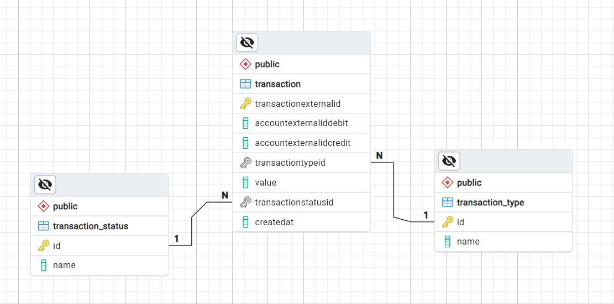

# Yape Code Challenge :rocket:

# Problem

Every time a financial transaction is created it must be validated by our anti-fraud microservice and then the same service sends a message back to update the transaction status.
For now, we have only three transaction statuses:

<ol>
  <li>pending</li>
  <li>approved</li>
  <li>rejected</li>  
</ol>

Every transaction with a value greater than 1000 should be rejected.

```mermaid
  flowchart LR
    Transaction -- Save Transaction with pending Status --> transactionDatabase[(Database)]
    Transaction --Send transaction Created event--> Anti-Fraud
    Anti-Fraud -- Send transaction Status Approved event--> Transaction
    Anti-Fraud -- Send transaction Status Rejected event--> Transaction
    Transaction -- Update transaction Status event--> transactionDatabase[(Database)]
```

# Tech Stack

<ol>
  <li>Node. You can use any framework you want (i.e. Nestjs with an ORM like TypeOrm or Prisma) </li>
  <li>Any database</li>
  <li>Kafka</li>    
</ol>

We do provide a `Dockerfile` to help you get started with a dev environment.

You must have two resources:

1. Resource to create a transaction that must containt:

```json
{
  "accountExternalIdDebit": "Guid",
  "accountExternalIdCredit": "Guid",
  "tranferTypeId": 1,
  "value": 120
}
```

2. Resource to retrieve a transaction

```json
{
  "transactionExternalId": "Guid",
  "transactionType": {
    "name": ""
  },
  "transactionStatus": {
    "name": ""
  },
  "value": 120,
  "createdAt": "Date"
}
```

## Optional

You can use any approach to store transaction data but you should consider that we may deal with high volume scenarios where we have a huge amount of writes and reads for the same data at the same time. How would you tackle this requirement?

You can use Graphql;

# Solution

## Architecture

The solution is based on a microservices architecture, where we have the following services:

1. Transaction Service: responsible for creating and retrieving transactions.
2. Anti-Fraud Service: responsible for validating transactions and updating their status.

The communication between the services is done through Kafka, where the Transaction Service sends a message to the Anti-Fraud Service to validate the transaction and the Anti-Fraud Service sends a message back to the Transaction Service to update the transaction status.

## Transaction Service

The Transaction Service is a hybrid app that uses NestJS and TypeORM. It has two endpoints:

1. POST /transaction: responsible for creating a transaction.

2. GET /transaction/{id}: responsible for retrieving a transaction.

The service also sends a message to Kafka when a transaction is created.

Transaction Service will be available by default at the following URL: http://localhost:3000

Swagger documentation is available at the following URL: http://localhost:3000/api/transaction-ms

## Anti-Fraud Service

The Anti-Fraud Service is a Kafka consumer that listens to the transaction created event and validates the transaction. If the transaction value is greater than 1000, the status is set to rejected, otherwise, it is set to approved.

## Database

The database used in this solution is PostgreSQL.

### Entity Relationship Diagram (ERD)



### Redis Store

Redis Store is set up to cache the following data:

- transaction statuses for 1 day
- transaction types for 1 day
- transactions requested by id for 1 minute

This is to avoid unnecessary database queries.

## How to run

1. Run SQL dump that is located in the `./database` folder in 'app-nodejs-codechallenge' database

2. Run the following commands to start the services:

```bash
yarn transaction-ms
yarn anti-fraud-ms
```
